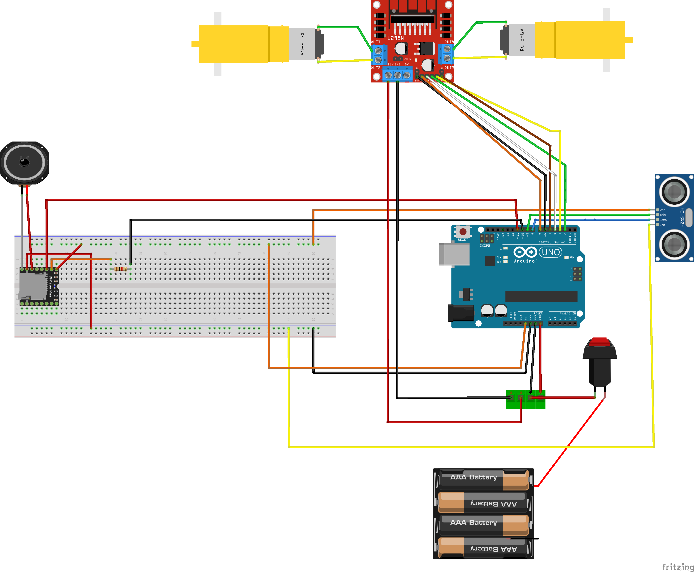

# Autonomous Obstacle-Avoiding Robot with Audio Feedback  
# Technical Description  
A complete hardware-software embedded system designed for a 2WD mobile robotics platform. This project demonstrates an autonomous robot capable of navigating unknown environments by mapping spatial data in real-time, executing evasive maneuvers and providing tiered audio feedback based on proximity to obstacles.  

  <video src="https://github.com/user-attachments/assets/1ae057c5-bf79-45de-845b-0239f8ae1a4c" width="800" controls></video>

  

# Architecture and logic control  
The architecture combines several functional modules, including `ultrasonic sensor` acquisition for distance measurement , a `dual H-bridge` power stage for differential motor actuation and an `asynchronous serial interface communicating` with a dedicated `MP3 playback module`.  
Control logic ties these components together using a continuous polling loop to evaluate sensor data against predefined distance thresholds, ensuring deterministic switching between forward navigation and randomized evasion states.  

# Objectives  
The primary objective was to design a reliable autonomous mobile node capable of:  
* **Dynamic Sensing:** Monitoring the forward path using an HC-SR04 ultrasonic sensor to calculate real-time distance.
* **Hardware Protection & Actuation:** Controlling high-current DC motors equipped with reduction gears using an L298N motor driver module , protecting the Arduino UNO microcontroller logic pins.
* **Autonomous Navigation:** Executing seamless evasion maneuvers by applying differential drive logic (accelerating one wheel more than the other) to rotate the chassis.  
* **Intuitive Telemetry:** Providing dynamic audio feedback via a DFPlayer Mini module and a 50mm Visaton K50 speaker (8Ω) , translating spatial data into easily interpretable acoustic alerts.  

# System Logic & Hardware  
The system's intelligence and reliability are centered around two main engineering assets:  
## 1. Threshold-Based Decision Logic  
   The system utilizes a deterministic control flow to manage behavior based on exact spatial measurements, ensuring unique reactions for different levels of proximity:  
* **Clear Path `(> 15 cm)`:** The robot safely moves forward.
* **Warning State `(10 - 15 cm)`:** The system halts, plays a warning audio file (0002.mp3), and initiates a randomized evasion maneuver.
* **Critical State `(< 10 cm)`:** The system halts instantly, triggers a critical alarm (0001.mp3), and executes a randomized evasion maneuver.
* **Randomized Evasion:** The turning direction (left or right) is chosen dynamically using a random value generator to prevent the robot from getting stuck in geometric dead-ends.

## 2. Hardware Circuit Design (Fritzing)  
Designed with clear component isolation, the circuit features independent data lines and proper power distribution.  

  

  

* **Power Management:** Utilizes a dedicated battery pack (AAA batteries) to supply the L298N driver and the motors, keeping the high-current draw separate from the logic voltage of the Arduino UNO.
* **Motor Driver Stage:** The L298N dual H-bridge enables bidirectional control and speed regulation for the two DC motors.
* **Asynchronous Communication:** The DFPlayer Mini MP3 module is interfaced using SoftwareSerial on dedicated digital pins (11, 10) to maintain reliable data transmission without blocking the main hardware UART.

# Skills
This project demonstrates proficiency in:  
**→ `Embedded Systems Programming (C/C++)` and hardware-software integration.**  
**→ `Sensor Polling`, including `ultrasonic wave timing` and `distance conversion`.**  
**→ `Actuator Control logic` using H-bridges and differential steering kinematics.**
**→ `Serial Communication Protocols (UART)` for interfacing with external peripherals.**
**→ `Algorithm Design`, specifically implementing deterministic state decisions and randomized recovery routines.**  

# Testing  
The final hardware implementation was tested and validated directly on the 2WD physical prototype.  
Experimental results demonstrated accurate `distance measurement`, rapid `motor reversal for evasion`, reliable `UART transmission to the audio module`, and correct `synchronization between spatial thresholds and acoustic feedback playback`.  

# Key Technologies  
`Arduino UNO SoC`, `Embedded C++`, `Fritzing`, `Ultrasonic Sensors (HC-SR04)`, `Power Electronics (L298N H-Bridge)`, `Differential Drive Kinematics`, `UART (SoftwareSerial)`, `DFPlayer Mini MP3`.

